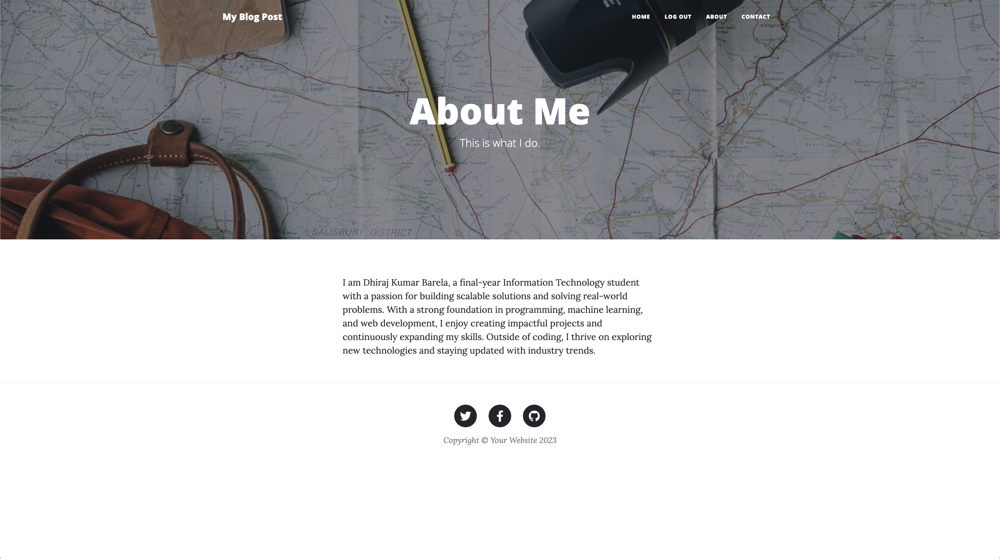
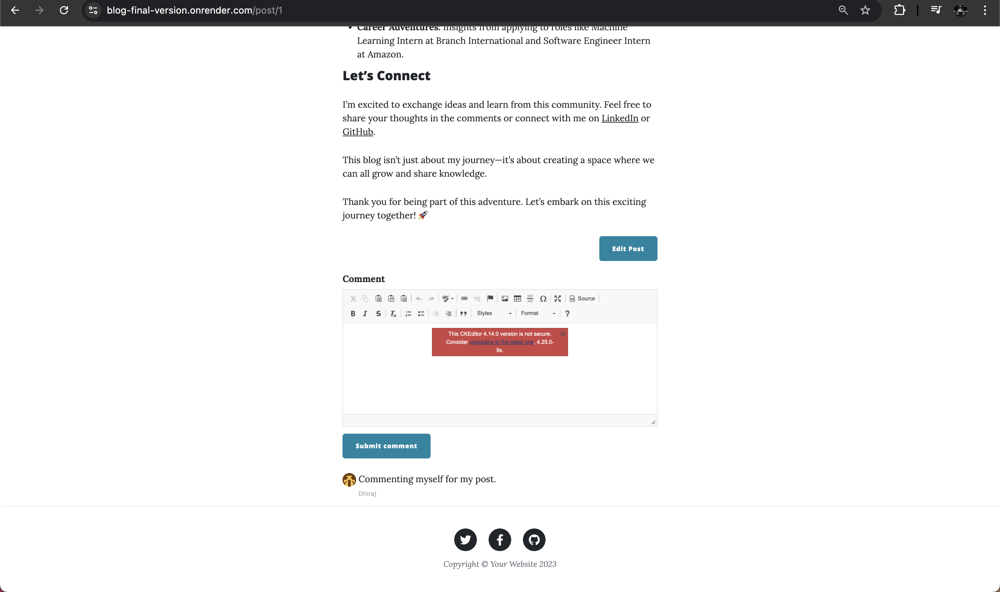
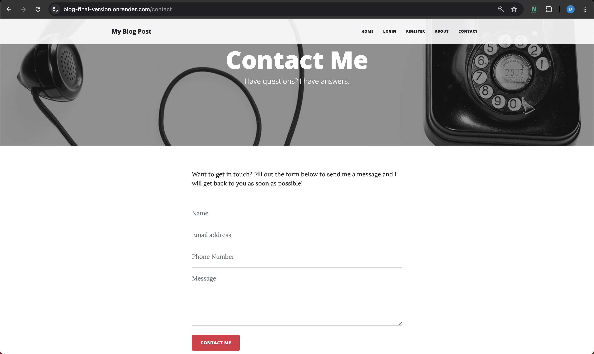
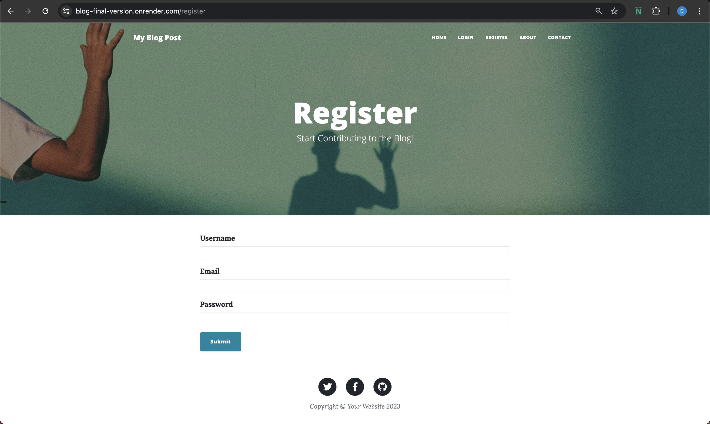

# Blog Project: Flask-Powered Blogging Platform

Welcome to my Flask-based blog application! 🚀 This project demonstrates my proficiency in full-stack development using Python and Flask. Below, you'll find a detailed overview of the project, its features, and how to run it locally.

## 🌟 Features

- **User Authentication**: Secure user registration and login system with hashed passwords.
- **Admin Functionality**: Admin-exclusive features for creating, editing, and deleting posts.
- **Dynamic Blog Content**: Add, view, edit, and delete blog posts with ease.
- **Comment System**: Registered users can comment on posts.
- **Bootstrap Integration**: Responsive and modern UI using Flask-Bootstrap.
- **Gravatar Support**: Display user avatars using Gravatar.
- **Rich Text Editing**: Create and edit posts with a CKEditor-powered editor.
- **Database Management**: SQLAlchemy-powered relational database with user, post, and comment relationships.

## 🔧 Tech Stack

### Backend:
- **Flask**: Microframework for web application development.
- **Flask-Login**: User session management.
- **Flask-SQLAlchemy**: ORM for database interactions.
- **Werkzeug**: Secure password hashing and validation.

### Frontend:
- **HTML/CSS**: Responsive design with Bootstrap.
- **Flask-Bootstrap**: Seamless Bootstrap integration.
- **Flask-CKEditor**: Rich text editor for creating content.

### Database:
- **SQLite** (default) or other SQL databases (via SQLAlchemy).

### Other Tools:
- **Gravatar**: User profile avatars.
- **Environment Variables**: Secure handling of secrets and configuration.

## 📸 Screenshots

| Feature             | Screenshot                          |
|---------------------|-------------------------------------|
| Home Page           |  |
| About               |    |
| Comment              |     |
| Contact             |      |
| Post             |      |
| Register             |      |

*(Add screenshots to an `images` folder in your repository)*

## 🚀 Demo

Check out the live version here: [Blog Application](https://blog-final-version.onrender.com/)

## 📁 Directory Structure

```
.
├── main.py                # Main application file
├── forms.py              # WTForms for handling user input
├── templates/            # HTML templates for pages
│   ├── index.html
│   ├── register.html
│   ├── login.html
│   ├── post.html
│   ├── make-post.html
│   ├── about.html
│   └── contact.html
├── static/               # Static assets (CSS, JS, images)
├── requirements.txt      # Dependencies for the project
└── README.md             # Project documentation
```

## 🛠️ Installation & Setup

Follow these steps to set up the project locally:

### Prerequisites:
- Python 3.8+
- `pip` (Python package manager)

### Steps:
1. **Clone the Repository**:
   ```bash
   git clone https://github.com/Dexter135790/Blog_Final_Version.git
   cd your-repo-name
   ```

2. **Set Up a Virtual Environment**:
   ```bash
   python -m venv venv
   source venv/bin/activate  # On Windows: venv\Scripts\activate
   ```

3. **Install Dependencies**:
   ```bash
   pip install -r requirements.txt
   ```

4. **Set Environment Variables**:
   Create a `.env` file in the root directory and add:
   ```
   FLASK_KEY=your-secret-key
   DB_URI=sqlite:///posts.db  # Or your preferred database URI
   ```

5. **Initialize the Database**:
   ```bash
   flask shell
   >>> from app import db
   >>> db.create_all()
   >>> exit()
   ```

6. **Run the Application**:
   ```bash
   flask run
   ```
   Access the app at [http://127.0.0.1:5000](http://127.0.0.1:5000).

## 🤝 Contributing

Feel free to fork this repository and submit pull requests. All contributions are welcome!

